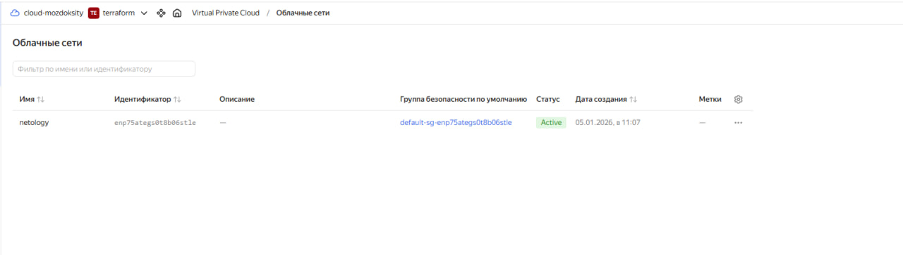
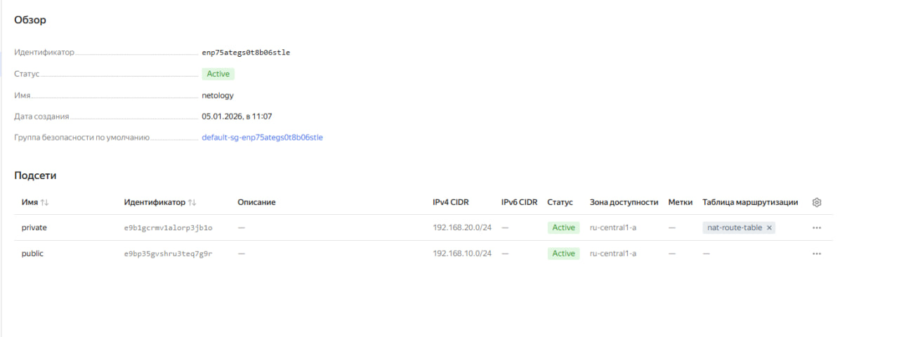
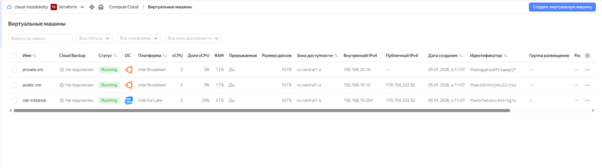
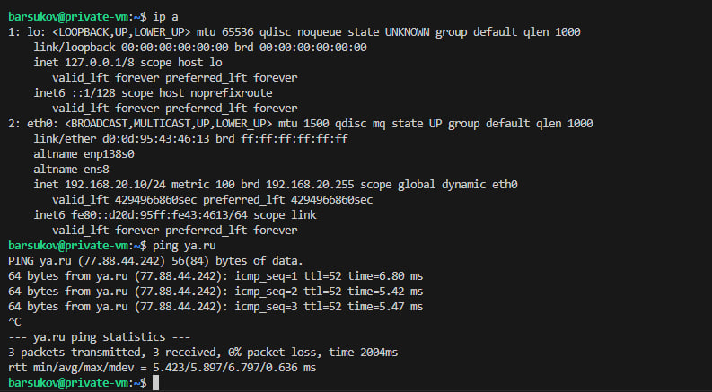

# Домашнее задание к занятию «Организация сети» Барсуков Алексей
 
### Подготовка к выполнению задания

1. Домашнее задание состоит из обязательной части, которую нужно выполнить на провайдере Yandex Cloud, и дополнительной части в AWS (выполняется по желанию). 
2. Все домашние задания в блоке 15 связаны друг с другом и в конце представляют пример законченной инфраструктуры.  
3. Все задания нужно выполнить с помощью Terraform. Результатом выполненного домашнего задания будет код в репозитории. 
4. Перед началом работы настройте доступ к облачным ресурсам из Terraform, используя материалы прошлых лекций и домашнее задание по теме «Облачные провайдеры и синтаксис Terraform». Заранее выберите регион (в случае AWS) и зону.

---
### Задание 1. Yandex Cloud 

### РЕШЕНИЕ

Создана сеть netology:

Созданы подсети и route table:

Созданы NAT и ВМ

Проверка доступ в интернет из ВМ в приватной подсети:

